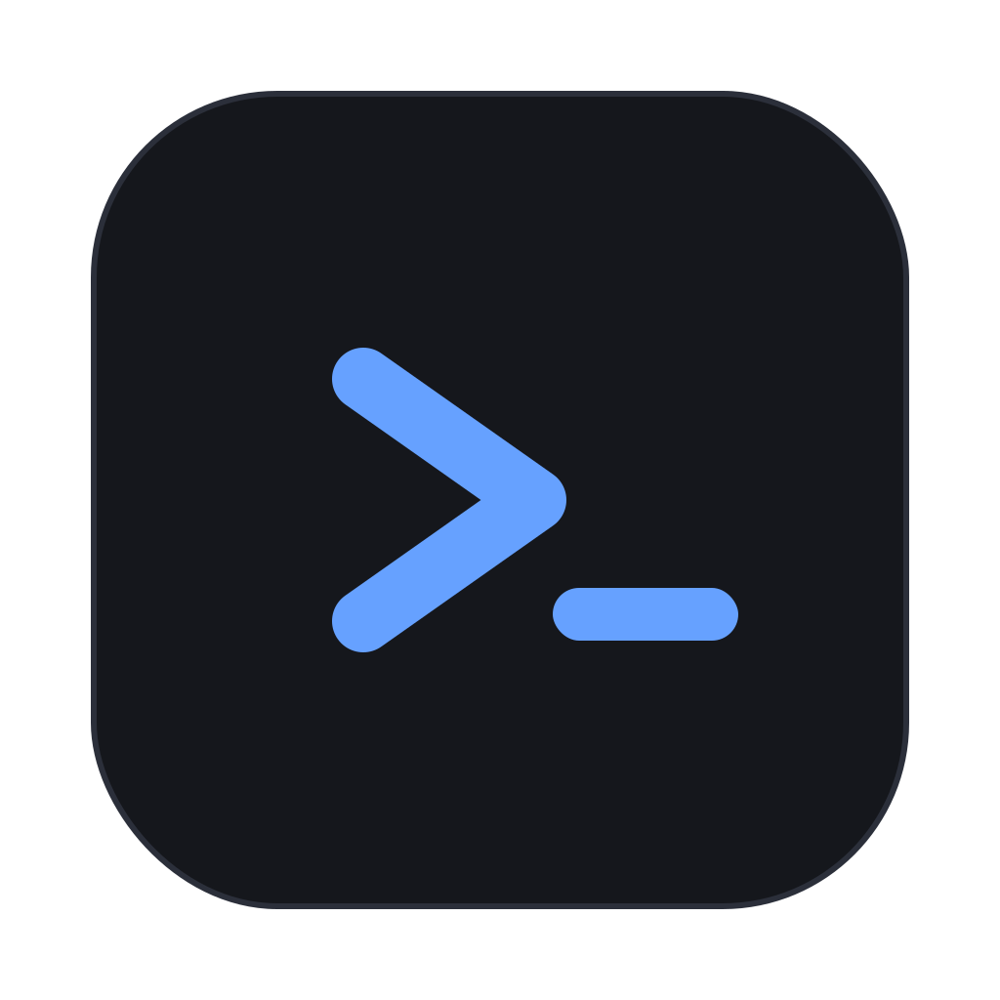

<p align="center">
  
</p>

<h1 align="center">Tessera</h1>

<p align="center">
  A GPU-accelerated terminal emulator in Rust with native, draggable pane
  splitting and tabs — the Ghostty look with iTerm2-style splits.
</p>

---

Tessera tiles your shells like a mosaic: split panes by keyboard **or** by
dragging the borders between them, organise them into colourable, renamable,
reorderable tabs, and drag a tab straight onto a pane to merge it in. Each pane
is a real terminal running a real shell (or `tmux`).

## Features

- **Native splits** — a binary tiling tree of panes, no `tmux` required. Each
  pane owns its own PTY + shell.
- **Draggable everything** — drag a border to resize neighbours; drag a tab to
  reorder it, or drop it onto a pane to merge it in as a split (tab tearing),
  iTerm2-style, with live drop previews.
- **Tabs** — open with `Cmd+T`, jump with `Cmd+1..9`; **right-click for a
  colour**, **double-click to rename**, drag to reorder.
- **Keyboard-first** — splits, pane navigation (`Cmd+Alt+Arrow`), and direct
  pane focus (`Opt+1..9`).
- **GPU-accelerated** rendering via `eframe`/`egui`.
- **Real terminal emulation** — full VT/ANSI, colours, scrollback, selection,
  copy/paste — powered by Alacritty's terminal core.

## Keybindings

| Shortcut | Action |
|---|---|
| `Cmd+T` | New tab |
| `Cmd+1` … `Cmd+9` | Switch to tab N |
| `Opt+1` … `Opt+9` | Focus pane N in the current tab |
| `Cmd+D` | Split right (panes side-by-side) |
| `Cmd+Shift+D` | Split down (panes stacked) |
| `Cmd+W` | Close the focused pane |
| `Cmd+Alt+←/→/↑/↓` | Move focus between panes |
| drag a border | Resize the two adjacent panes |
| double-click a tab | Rename it · right-click a tab | Set its colour |
| drag a tab | Reorder it in the strip, or drop on a pane to merge |

## Run it

Run Tessera straight from source — all you need is the
[Rust toolchain](https://rustup.rs):

```sh
git clone https://github.com/elstarkov/tessera
cd tessera
cargo run --release            # launches your $SHELL
cargo run --release -- --help  # usage
```

No install step, no app bundle, no Gatekeeper prompts — just clone and run.

## tmux

Tessera gives you native GUI splits without tmux. To drive panes from tmux
instead, run it as the command: `tessera tmux new -A -s main`.

## Limitations

- **Fonts:** uses egui's bundled monospace with no font fallback yet, so Nerd
  Font icons, emoji, CJK, and powerline glyphs may not render. No ligatures.
- **No config file** yet — font, theme, shell, and keybindings aren't
  customisable without editing the source.
- **No inline images** (Sixel / kitty / iTerm protocols), no scrollback search.
- **Not security-audited.** `cargo audit` is clean, but treat it as a v0.1
  hobby project, not hardened software.

## Architecture

```
src/
  main.rs     CLI parsing + window bootstrap (eframe)
  app.rs      Tessera: update loop, tabs, rendering, dividers, shortcuts,
              drag-and-drop (reorder / merge), rename popup, PTY events
  layout.rs   Arena-based binary split tree + pure geometry pass + merge
vendor/
  egui_term/  Vendored terminal widget (MIT), patched so keyboard input
              follows the focused pane instead of the mouse pointer
```

## Credits & license

Tessera is [MIT-licensed](LICENSE). It vendors and lightly patches
[`egui_term`](https://github.com/Harzu/egui_term) (MIT) and builds on
[`alacritty_terminal`](https://github.com/alacritty/alacritty),
[`egui`/`eframe`](https://github.com/emilk/egui), and `portable-pty`.

Built in Rust, pair-programmed with [Claude Code](https://claude.com/claude-code).

## Roadmap

- Font fallback (Nerd Fonts / emoji / CJK) and ligatures
- Config file (font, theme, default shell, keybindings)
- tmux control-mode (`tmux -CC`) integration
- Zoom a pane to fullscreen; scrollback search
